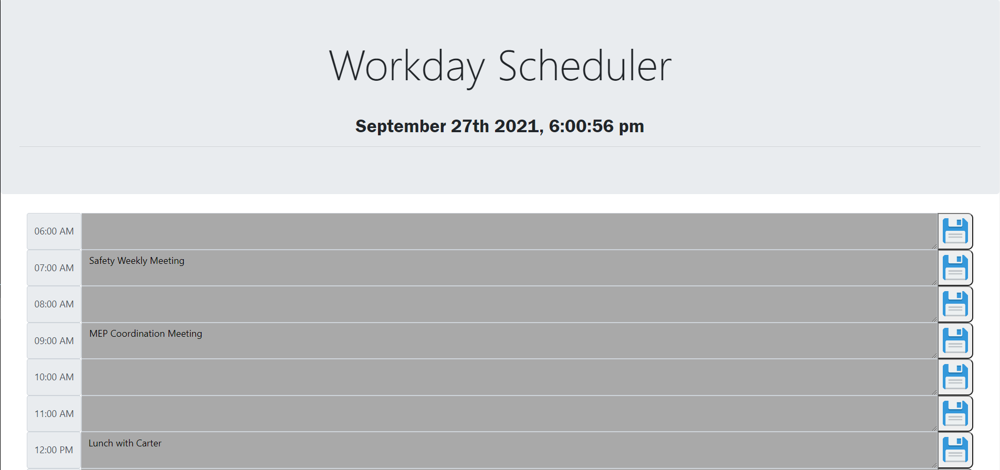
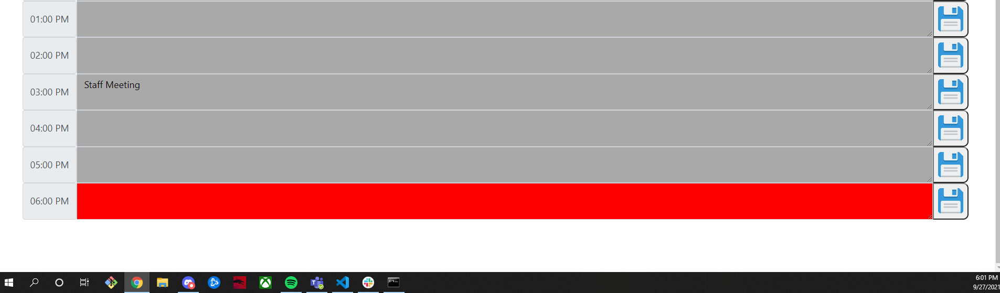

# Daily Scheduler

## Description
This application creates a daily work-hours scheduler. The framework was created using bootstraps "text-input" component.  This includes a text on the left (used to indicate the hour) and then an input on the right.  It also includes a jumbotron at the top.  The jumbotron includes the date and time that updates each second.  Each section is colored, indicating whether that hour has passed, or is in the future.  I did this by looping through each text box (brought in with an array with .querySelectorAll) then matching each index of that array with the hour of the time of day.  I then stored each response in local storage when the save button is pressed.  This application could be used to plan out your day, while saving the content of the scheduler even after you close the tab or browser.

The deployed application can be found here: https://jstndhouk.github.io/Daily-Scheduler/

## Screenshots

